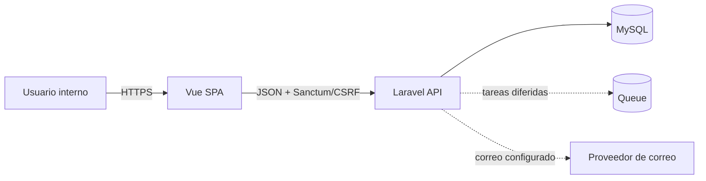

# Arquitectura de Índice ERP

## Estado del documento

Este documento describe la arquitectura lógica objetivo y el plan de trabajo de
la **prioridad 1: fundamentos, seguridad y usuarios**. No describe topología de
producción, proveedores, credenciales ni procedimientos privados de operación.

El contenido es una decisión de diseño y un plan. No implica que las capacidades
mencionadas ya estén implementadas.

## Contexto del producto

Índice ERP comienza como sistema interno para una sola empresa, una sede
operativa y una bodega principal. La arquitectura debe permitir incorporar más
bodegas o sedes después, pero el MVP no debe asumir multiempresa ni ofrecer
configuración SaaS.

Restricciones acordadas:

- Una empresa.
- Una moneda operativa inicial.
- Interfaz en español.
- Código, base de datos y API en inglés.
- Usuarios internos creados por un administrador.
- Roles fijos: `admin`, `operator`, `viewer`.
- Monolito modular como unidad de desarrollo y despliegue.

## Objetivos de arquitectura

En orden de prioridad:

1. Seguridad y consistencia de los datos.
2. Trazabilidad de operaciones sensibles.
3. Entrega incremental de flujos completos.
4. Mantenibilidad por un equipo pequeño.
5. Extensión futura sin abstracciones prematuras.

No son objetivos actuales:

- Multiempresa o aislamiento entre tenants.
- Microservicios.
- Constructor dinámico de roles y permisos.
- OAuth, inicio de sesión social o SSO.
- Autenticación multifactor.
- Edición sin código de workflows.
- Historial campo por campo para todas las entidades.

## Vista de contexto



La SPA y la API forman una sola aplicación desde la perspectiva del producto.
Laravel es la frontera de confianza: Vue puede mejorar la experiencia, pero no
decide autorización ni valida invariantes finales.

## Estilo arquitectónico

### Monolito modular

El backend permanece en una única aplicación Laravel. Cada módulo representa un
área del dominio y posee sus casos de uso, reglas de autorización y modelos.
Una operación que cruce módulos ocurre en un servicio de aplicación y una sola
transacción cuando sea necesario.

No se crearán servicios de red independientes hasta que exista una razón
medible: escalado distinto, ciclo de despliegue distinto, aislamiento de fallos
o equipo propietario independiente.

### Capas backend

```text
HTTP Route
  └─ Controller
      ├─ Form Request: forma y validez de la entrada
      ├─ Policy: sujeto, acción y recurso
      └─ Service/Action: caso de uso y transacción
          ├─ Eloquent Model: persistencia e invariantes locales
          ├─ Domain Event: hecho confirmado, solo cuando sea útil
          └─ Audit Writer: registro mínimo de la operación
      └─ API Resource: contrato de salida
```

Reglas de dependencia:

- HTTP depende de aplicación; aplicación no depende de Vue.
- Una Policy puede consultar el usuario y recurso, pero no ejecutar el caso de
  uso.
- Los modelos no conocen requests, controllers ni respuestas HTTP.
- Un API Resource controla qué atributos salen de la frontera.
- La infraestructura de correo, queue o logs se accede mediante contratos del
  framework, no desde componentes Vue.

### Capas frontend

```text
Router / View
  └─ Pinia Store o composable
      └─ API Service
          └─ Axios client
              └─ Laravel API
```

- El router protege navegación como experiencia de usuario.
- Pinia mantiene identidad y capacidades de la sesión.
- Los servicios API encapsulan URLs y formatos HTTP.
- La API vuelve a autenticar y autorizar cada operación.

## Módulos del dominio

| Módulo | Responsabilidad | Prioridad |
|---|---|---:|
| Identity & Access | Sesión, usuarios, roles y ciclo de contraseñas | 1 |
| Audit | Trazabilidad de acciones sensibles | 1 |
| Catalog | Productos, categorías, autores, editoriales y variantes | 2 |
| Inventory | Existencias, movimientos, ajustes y transferencias | 2 |
| Purchasing | Proveedores, órdenes y recepciones | 3 |
| Sales | Clientes, cotizaciones, pedidos y ventas | Posterior |
| Reporting | Lecturas y métricas operativas | Posterior |

Los módulos posteriores aparecen para conservar límites conceptuales, no como
compromiso de implementación inmediata.

## Decisiones de identidad y acceso

### Autenticación

- La SPA propia usa Sanctum con sesión, cookie segura y protección CSRF.
- El registro público queda eliminado del contrato de la API.
- El login acepta email y contraseña y retorna un error genérico ante credenciales
  inválidas, usuario inexistente o inactivo.
- La sesión se regenera al autenticar y se invalida al cerrar sesión.
- Las rutas de login y recuperación de contraseña tienen rate limit por identidad
  normalizada e IP.
- Un middleware central verifica que el usuario continúe activo en cada request
  autenticado. Desactivar una cuenta debe cortar también sesiones existentes.
- La recuperación usa el password broker de Laravel cuando hay transporte de
  correo configurado.
- El usuario puede cambiar su propia contraseña confirmando la actual.

Estándar de contraseña inicial:

- Mínimo de 15 caracteres mientras no exista MFA.
- Máximo de al menos 64 caracteres.
- Se permiten espacios y Unicode.
- No se imponen reglas arbitrarias de mayúsculas, números o símbolos.
- No se fuerzan cambios periódicos sin evidencia de compromiso.
- El hash lo gestiona exclusivamente Laravel.

### Alta de usuarios

Existen dos caminos controlados:

1. **Primer administrador:** comando interactivo de consola. Nunca un seeder con
   una contraseña conocida o almacenada en el repositorio.
2. **Usuarios posteriores:** un administrador crea la cuenta. Si el correo está
   disponible, el sistema envía un enlace de establecimiento de contraseña. Sin
   correo, se define una contraseña temporal y el usuario debe cambiarla en el
   primer acceso.

El usuario no se elimina físicamente desde la aplicación. Puede desactivarse y
reactivarse. Desactivar conserva autoría y trazabilidad histórica.

### Roles y autorización

Los roles son un enum de aplicación almacenado en `users.role`; no se necesita
una tabla de permisos ni un paquete externo para tres roles fijos.

| Capacidad | admin | operator | viewer |
|---|:---:|:---:|:---:|
| Ver panel y catálogos | Sí | Sí | Sí |
| Administrar usuarios y roles | Sí | No | No |
| Crear o editar catálogo | Sí | Sí | No |
| Registrar movimientos ordinarios | Sí | Sí | No |
| Ejecutar correcciones sensibles | Sí | No | No |
| Consultar auditoría | Sí | No | No |

Principios:

- Denegar por defecto.
- Verificar sujeto, acción y recurso en cada request.
- Policies para recursos; Gates para acciones globales excepcionales.
- El frontend recibe capacidades para presentar la interfaz, no nombres de rol
  para reimplementar reglas.
- Un usuario no puede elevar su propio rol ni desactivarse si es el último
  administrador activo.
- Todo cambio de rol o estado se audita.

## Modelo conceptual de la prioridad 1

### User

Además de los atributos actuales de identidad:

| Campo | Propósito |
|---|---|
| `role` | Enum `admin`, `operator`, `viewer` |
| `is_active` | Habilita o bloquea acceso operativo |
| `must_change_password` | Obliga a reemplazar una credencial temporal |
| `created_by` | Administrador que creó la cuenta; nullable para bootstrap |
| `updated_by` | Último actor administrativo |
| timestamps | Creación y última actualización |

Las claves `created_by` y `updated_by` son autorreferencias nullable. El borrado
del actor no debe borrar usuarios ni auditoría.

### AuditLog

Registro append-only para eventos sensibles:

| Campo | Propósito |
|---|---|
| `actor_id` | Usuario responsable; nullable para procesos del sistema |
| `event` | Nombre estable en inglés, por ejemplo `user.deactivated` |
| `subject_type` / `subject_id` | Recurso afectado |
| `metadata` | Contexto mínimo no sensible en JSON |
| `request_id` | Correlación técnica opcional |
| `created_at` | Fecha UTC del evento |

No tiene `updated_at`: un evento de auditoría confirmado no se edita. No se
almacenan contraseñas, hashes, tokens, cookies, payloads completos ni datos
personales sin necesidad explícita.

Eventos mínimos:

- `auth.login_succeeded`
- `auth.login_failed`, sin revelar ni persistir una contraseña
- `auth.logout`
- `user.created`
- `user.updated`
- `user.role_changed`
- `user.activated`
- `user.deactivated`
- `user.password_changed`
- `authorization.denied` para operaciones sensibles

Los intentos fallidos sin un actor conocido deben limitar sus metadatos para no
convertir el log en una base de datos de direcciones probadas.

## Contrato API objetivo de la prioridad 1

Las rutas exactas se confirmarán al implementar, preservando estas capacidades:

| Método y recurso | Capacidad | Autorización |
|---|---|---|
| `POST /api/login` | Iniciar sesión | Público con rate limit |
| `POST /api/logout` | Cerrar sesión | Autenticado |
| `GET /api/user` | Obtener sesión y capacidades | Autenticado y activo |
| `PUT /api/user/password` | Cambiar contraseña propia | Autenticado y activo |
| Password reset de Laravel | Solicitar/restablecer contraseña | Público con rate limit |
| `GET /api/users` | Listar usuarios | Admin |
| `POST /api/users` | Crear o invitar usuario | Admin |
| `GET /api/users/{user}` | Consultar usuario | Admin |
| `PUT /api/users/{user}` | Editar nombre, email o rol | Admin |
| `PATCH /api/users/{user}/status` | Activar o desactivar | Admin |
| `GET /api/audit-logs` | Consultar auditoría paginada | Admin |

No habrá `POST /api/register`. La ausencia del endpoint forma parte del contrato,
no solo de la interfaz.

La respuesta de sesión debe exponer datos del usuario y una lista de capacidades
efectivas, por ejemplo `users.view`, `users.manage` y `audit.view`. Las Policies
siguen siendo la fuente de verdad.

## Plan de trabajo: prioridad 1

Cada fase termina en una entrega comprobable. Las fases pueden vivir en una sola
rama, pero no se considera completa la prioridad hasta cumplir todos los
criterios de aceptación.

### Fase 0 — Contrato y línea base

**Objetivo:** fijar comportamiento antes de cambiar datos.

- Inventariar rutas y pruebas actuales de login, registro, sesión y logout.
- Identificar dependencias frontend de la ruta de registro.
- Definir enum de roles, capacidades y matriz permitida/denegada.
- Confirmar requisitos de correo para invitación y recuperación.
- Crear pruebas de regresión para los flujos existentes que deban conservarse.

**Salida:** matriz de autorización y contrato HTTP aprobados; alcance sin rutas
ambiguas.

### Fase 1 — Persistencia y bootstrap seguro

**Objetivo:** representar roles, estado y autoría sin perder usuarios existentes.

- Añadir campos de `User` y asignar una migración determinista a registros
  existentes.
- Crear enum de roles y casts correspondientes.
- Incorporar restricciones, índices y claves foráneas.
- Crear el almacenamiento append-only de auditoría.
- Implementar el comando interactivo e idempotente para el primer administrador.
- Definir protección contra desactivar o degradar al último admin activo.

**Migración propuesta:** los usuarios existentes se mantienen activos; una regla
explícita determina cuál se promueve a `admin`. La migración no debe elegir un
administrador de manera silenciosa en producción.

**Salida:** modelo de datos migrable hacia adelante y un primer administrador
sin credenciales versionadas.

### Fase 2 — Ciclo de autenticación

**Objetivo:** cerrar el registro público y completar el ciclo seguro de sesión.

- Eliminar endpoint, controlador y navegación de registro público.
- Endurecer login con mensajes genéricos, rate limit y regeneración de sesión.
- Rechazar usuarios inactivos durante login y en cada request autenticado.
- Implementar logout con invalidación de sesión y rotación CSRF.
- Implementar cambio de contraseña propia.
- Integrar solicitud y consumo de reset mediante password broker.
- Forzar cambio de contraseña temporal antes de permitir el resto de la app.

**Salida:** usuario activo puede administrar su sesión; usuario inactivo o
anónimo no accede a recursos protegidos; no existe registro público.

### Fase 3 — Autorización centralizada

**Objetivo:** aplicar mínimo privilegio en el servidor.

- Crear Policies para usuarios y para los recursos existentes.
- Centralizar capacidades globales excepcionales en Gates.
- Remover comparaciones de rol dispersas.
- Devolver capacidades efectivas con la sesión.
- Cubrir por pruebas cada combinación relevante de rol, acción y resultado.
- Verificar ataques de IDOR y escalamiento de privilegios.

**Salida:** toda ruta protegida responde `401`, `403` o éxito de forma coherente;
ningún control depende solo de Vue.

### Fase 4 — Administración de usuarios

**Objetivo:** permitir operación diaria sin acceso directo a base de datos.

- Listado paginado con búsqueda y filtros por rol/estado.
- Alta o invitación de usuarios.
- Edición de identidad y rol.
- Activación y desactivación con confirmación explícita.
- Pantalla de perfil para cambio de contraseña.
- Estados de carga, vacío, error y validación por campo.
- Navegación basada en capacidades.

**Salida:** un admin completa el ciclo de usuario desde la interfaz; operator y
viewer no descubren ni ejecutan acciones administrativas.

### Fase 5 — Auditoría y observabilidad de seguridad

**Objetivo:** poder reconstruir quién cambió acceso y cuándo.

- Emitir los eventos mínimos definidos en este documento.
- Incorporar actor y autoría dentro de la misma transacción del caso de uso.
- Añadir consulta paginada y filtrable solo para admin.
- Correlacionar fallos técnicos mediante `request_id` cuando esté disponible.
- Sanitizar campos controlados por usuario antes del logging.
- Definir política operativa de retención fuera del código público.

**Salida:** cambios administrativos y accesos sensibles son trazables sin
registrar secretos.

### Fase 6 — Verificación y salida

**Objetivo:** demostrar comportamiento completo antes de desplegar.

- Ejecutar pruebas backend, Pint y build frontend.
- Smoke test real de login, logout, cambio/reset de contraseña y sesión expirada.
- Probar manualmente cada rol contra acciones permitidas y denegadas.
- Probar desactivación con una sesión ya abierta.
- Probar concurrencia al modificar al último administrador.
- Confirmar que logs y respuestas no exponen secretos ni existencia de cuentas.
- Documentar variables de correo y procedimientos operativos sin valores reales.

**Salida:** evidencia reproducible de criterios de aceptación y plan de reversión
de la migración.

## Criterios de aceptación de la prioridad 1

1. `POST /api/register` no existe y la SPA no muestra registro público.
2. El primer administrador se crea sin secretos versionados.
3. Un admin puede crear, editar, activar, desactivar y asignar roles a usuarios.
4. Nadie puede eliminar o degradar al último admin activo.
5. Un usuario inactivo no puede iniciar sesión y pierde acceso con sesiones
   existentes.
6. Un usuario activo puede iniciar/cerrar sesión y cambiar su contraseña.
7. La recuperación funciona cuando el correo está configurado y no enumera
   cuentas.
8. `admin`, `operator` y `viewer` obtienen exactamente las capacidades de la
   matriz.
9. Cada acción protegida se autoriza en Laravel; Vue solo refleja capacidades.
10. Las respuestas distinguen `401`, `403` y `422` de forma consistente.
11. Los cambios de rol, estado y contraseña generan auditoría sin secretos.
12. Tests, formatter, build y smoke tests del flujo real terminan correctamente.

## Riesgos y mitigaciones

| Riesgo | Mitigación |
|---|---|
| Bloquear a todos los administradores | Invariante transaccional de último admin y comando de recuperación controlado |
| Sesión activa tras desactivar usuario | Verificación central de `is_active` en cada request e invalidación de sesiones |
| Reglas distintas entre frontend/backend | Policies como fuente de verdad; frontend consume capacidades |
| Enumeración de emails | Respuestas genéricas y rate limit en login/reset |
| Logs con secretos o PII | Allowlist de metadatos; nunca almacenar payload completo |
| Migración ambigua de usuarios actuales | Selección explícita del primer admin antes de desplegar |
| Complejidad prematura de permisos | Enum fijo y matriz documentada; sin RBAC dinámico |

## Decisiones aplazadas

Se revisarán solo cuando exista un requisito:

- MFA.
- Verificación de email separada de la invitación.
- Permisos configurables y roles personalizados.
- Equipos, sedes y restricciones por bodega.
- SSO u OAuth.
- Auditoría detallada de valores anteriores y nuevos.
- Multiempresa.
- Separación en servicios independientes.

Aplazar significa no crear tablas, interfaces o extensiones vacías para estos
casos.

## Calidad y gobierno

Las reglas de contribución y estándares ejecutables están en [`AGENTS.md`](AGENTS.md).
Las decisiones difíciles de revertir deben actualizar este documento antes de
implementarse. Un cambio de arquitectura debe indicar:

- problema observable;
- decisión y alternativas descartadas;
- impacto en datos y contratos;
- estrategia de migración y reversión;
- pruebas que demuestran el cambio.

## Referencias

- [Laravel 13: Authentication](https://laravel.com/docs/13.x/authentication)
- [Laravel 13: Authorization](https://laravel.com/docs/13.x/authorization)
- [Laravel 13: Password Reset](https://laravel.com/docs/13.x/passwords)
- [Laravel Sanctum](https://laravel.com/docs/13.x/sanctum)
- [Laravel 13: Rate Limiting](https://laravel.com/docs/13.x/rate-limiting)
- [OWASP Authentication Cheat Sheet](https://cheatsheetseries.owasp.org/cheatsheets/Authentication_Cheat_Sheet.html)
- [OWASP Authorization Cheat Sheet](https://cheatsheetseries.owasp.org/cheatsheets/Authorization_Cheat_Sheet.html)
- [OWASP Password Storage Cheat Sheet](https://cheatsheetseries.owasp.org/cheatsheets/Password_Storage_Cheat_Sheet.html)
- [OWASP Logging Cheat Sheet](https://cheatsheetseries.owasp.org/cheatsheets/Logging_Cheat_Sheet.html)
- [Vue Security](https://vuejs.org/guide/best-practices/security.html)
