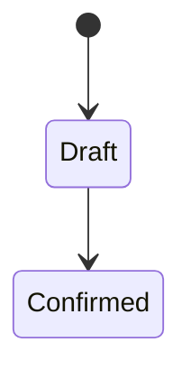

# Plantilla QA para nuevas funcionalidades

Copiar esta plantilla a `docs/qa/features/<modulo>-<funcionalidad>.md` en la
misma entrega que implementa el comportamiento. Sustituir todas las secciones;
no dejar placeholders en una funcionalidad marcada como terminada.

## 1. Identificación

- **Módulo:**
- **Funcionalidad:**
- **Responsable funcional:**
- **Versión/entrega:**
- **Estado:** diseño | desarrollo | QA | liberada
- **Documentos relacionados:** historia, ADR, `ARCHITECTURE.md`, contrato API

## 2. Problema y alcance

- Problema operativo resuelto.
- Actores que usan la función.
- Flujo incluido.
- Fuera de alcance explícito.
- Compatibilidad o migración desde el comportamiento anterior.

## 3. Criterios de aceptación

Numerar resultados observables. Cada criterio debe mapear al menos a un caso de
prueba y evitar detalles incidentales de implementación.

| AC | Resultado observable | Caso(s) QA |
|---|---|---|
| AC-01 |  |  |

## 4. Roles y capacidades

Si se añade una capacidad, actualizar primero la matriz en `AGENTS.md` y
`ARCHITECTURE.md`.

| Acción | admin | operator | viewer | Regla adicional |
|---|:---:|:---:|:---:|---|
|  |  |  |  |  |

Verificar interfaz y backend por separado. Ocultar un control nunca sustituye
una Policy o Gate.

## 5. Estados e invariantes

- Estados válidos del recurso.
- Transiciones permitidas y prohibidas.
- Invariantes transaccionales.
- Comportamiento ante concurrencia y reintentos.
- Estrategia de baja: desactivación, anulación, soft delete o compensación.

Eliminar el diagrama si no existe una máquina de estados real.

## 6. Contrato API

| Método | Ruta | Capacidad | Entrada | Éxito | Errores esperados |
|---|---|---|---|---|---|
|  |  |  |  |  |  |

Documentar:

- Normalización y validación.
- Paginación, orden y filtros.
- Idempotencia.
- `401`, `403`, `404`, `422` y `429` aplicables.
- Campos que nunca deben exponerse.

## 7. Persistencia y migraciones

- Tablas/columnas/índices/foreign keys.
- Datos existentes y valores deterministas.
- Pasos `up` y `down`.
- Conteos o checksums antes/después.
- Riesgo de bloqueo y volumen esperado.
- Plan de rollback sin usar datos de producción en QA.

## 8. Auditoría y observabilidad

| Evento | Actor | Sujeto | Metadata permitida | Momento de confirmación |
|---|---|---|---|---|
|  |  |  |  |  |

Definir además:

- Correlación por `X-Request-ID`.
- Métrica o log técnico necesario.
- Datos sensibles prohibidos.
- Alerta o runbook requerido.

## 9. Datos de prueba

| Alias | Datos relevantes | Preparación | Limpieza |
|---|---|---|---|
|  |  |  |  |

Usar datos sintéticos. No incorporar credenciales ni PII real al documento.

## 10. Casos de prueba

| ID | Pri. | Precondición | Pasos | Resultado esperado | Automatización |
|---|---:|---|---|---|---|
| MOD-001 | P0 |  |  |  | Sí/No + archivo |

Cobertura mínima:

- Flujo positivo principal.
- Validaciones por campo y límites.
- Vacío, carga, éxito y error.
- Cada combinación relevante de rol/acción.
- Acceso directo por API e IDOR.
- Estado/transición inválida.
- Concurrencia e idempotencia cuando aplique.
- Migración y rollback.
- Auditoría sin secretos.
- Teclado, nombres accesibles y viewport móvil en UI.

## 11. Regresión afectada

- Casos existentes que deben repetirse.
- Módulos consumidores.
- Contratos incompatibles y migración de callers.
- Navegación, sesión o capacidades afectadas.

## 12. Evidencia y resultado

- Ambiente/versión:
- Fecha/responsable:
- Comandos ejecutados:
- Casos aprobados/fallidos/bloqueados:
- Defectos:
- Riesgos residuales:
- Decisión Go/No-Go y aprobador:

## 13. Mantenimiento tras liberar

- Añadir los casos estables a `TEST-CASES.md` o enlazar este documento desde el
  índice.
- Añadir el smoke crítico a `REGRESSION.md` si una falla bloquearía operación o
  seguridad.
- Mantener pruebas automatizadas que detecten una regresión observable.
- Actualizar el documento cuando cambien estados, capacidades, contratos o
  migraciones; no conservar expectativas obsoletas.
